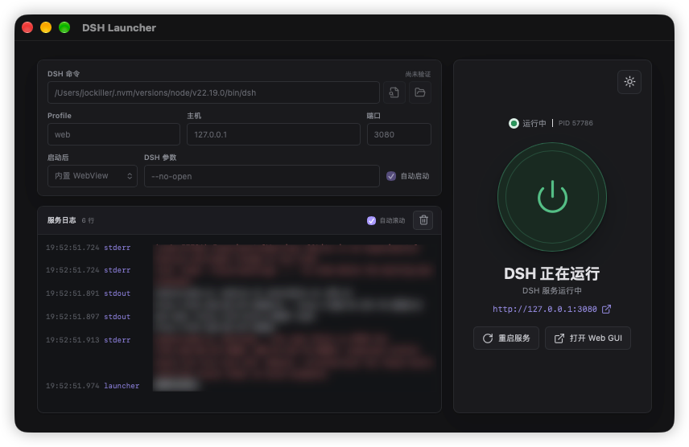
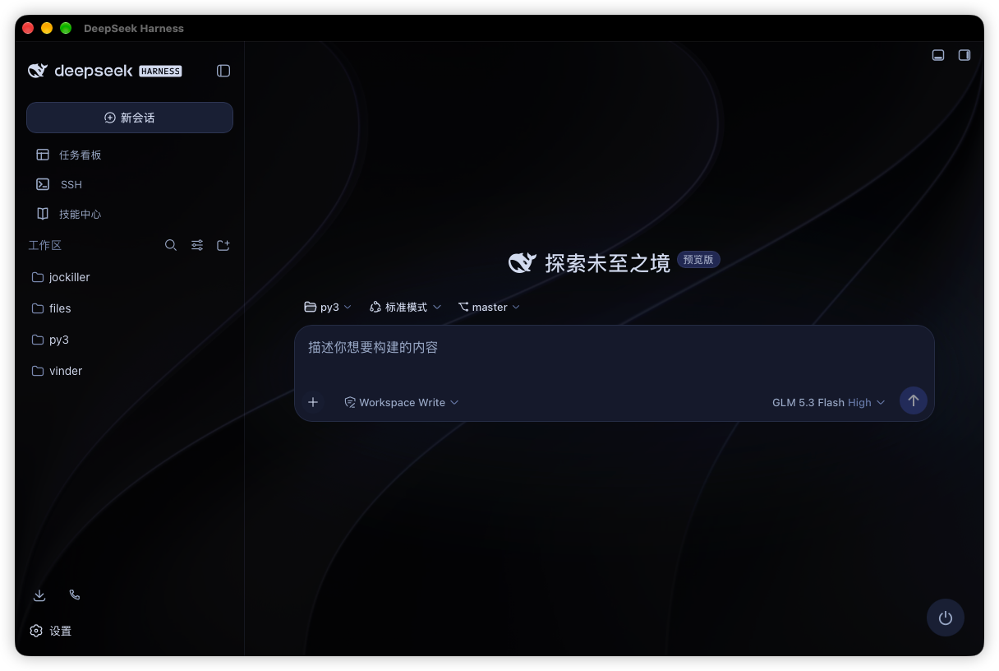

# DSH Launcher

简体中文 | [English](README_EN.md)

**超小的 DSH 启动器，无侵入，你不需要担心有任何插件冲突。支持一键安装和自动启动。**

轻量桌面应用，一键安装、启动和管理本地 DeepSeek Harness（DSH）Web 服务。基于 Tauri 2 + React + Rust。

## 界面





## 功能

- **自动识别**：自动检测已安装的 DSH，也可手动选择
- **一键安装**：在空目录中自动下载校验 Node LTS 并安装 DSH，不修改系统 PATH
- **一键升级**：自动检测托管 DSH 新版本，确认后停止服务再升级
- **服务管理**：启动 / 停止 / 重启，HTTP 健康检查，实时日志
- **开箱即用**：服务就绪后自动打开内置 WebView 或默认浏览器
- **灵活配置**：Profile、监听地址、端口与附加 DSH 参数
- **兼容外部安装**：已有的 DSH 以只读方式检测使用，不会被修改
- **全平台**：macOS / Windows / Linux（arm64 与 x64），跟随系统明暗主题

## 使用提示

- 插件的安装与升级仍通过 DSH 自身的命令和配置完成
- 托管环境只提供 DSH 升级，不升级 Node；升级前会确认并停止服务，完成后不自动重启
- 外部 DSH 需确认可正常运行：`dsh --version`

## macOS 首次启动

- 应用未经 Apple 公证，若提示"未知开发者"，将 `DSH Launcher.app` 放入 `/Applications` 后执行：

  ```bash
  sudo xattr -r -d com.apple.quarantine "/Applications/DSH Launcher.app"
  ```

- macOS 15+ 首次启动会请求"本地网络"权限，请允许（系统设置 → 隐私与安全性 → 本地网络）

## 从源码构建

要求：Node.js 22+、Rust 1.88+，以及平台对应的 Tauri 2 依赖。

```bash
pnpm install --frozen-lockfile
pnpm run tauri dev        # 本地开发
pnpm run build:mac        # macOS 构建（补签 + 权限元数据校验）
pnpm run tauri build      # Windows / Linux 构建
```

## License

[MIT](LICENSE)